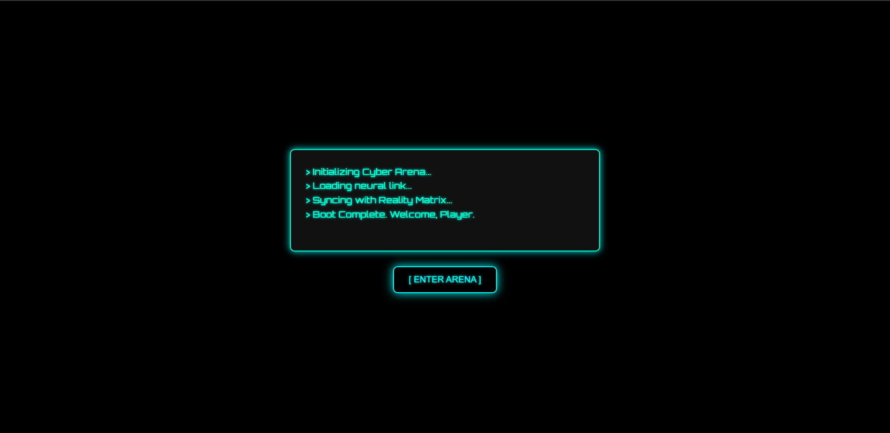

# 🕹️ Cyberpunk Rock-Paper-Scissors Game

Welcome to the futuristic version of the classic **Rock-Paper-Scissors** game — reimagined with a **cyberpunk theme**, a **console-style intro**, animated transitions, and immersive sound effects.

---

## 🚀 Features

- 🎮 Classic Rock 🪨 Paper 📄 Scissors ✂️ gameplay
- 🌐 Cyberpunk-themed user interface with animated visuals
- 💻 Console-style intro screen with auto-typing animation
- 🔊 Sound effects for win, lose, and tie outcomes
- 📈 Score tracking and dynamic result display
- ♻️ Replay functionality with smooth transitions

---

## 📁 Project Structure

├── index.html # Main HTML file
├── style.css # Cyberpunk-styled CSS
├── game.js # Game logic in JavaScript
└── README.md # Project documentation

---

## 🧠 How to Play

1. **Open the game** in your browser.
2. Watch the **console-style intro** auto-type your welcome.
3. Click **[ ENTER ARENA ]** to begin.
4. Choose your move: 🪨 Rock, 📄 Paper, or ✂️ Scissors.
5. View the result, score, and sounds that match the outcome.
6. Use the **Play Again** button to restart the match.

---

## 💻 Built With

- HTML5
- CSS3 (animations, transitions, and neon effects)
- Vanilla JavaScript
- [Google Fonts - Orbitron](https://fonts.google.com/specimen/Orbitron)
- [SoundJay](https://www.soundjay.com) for sound effects

---

## 📦 Installation

To run the game locally:

```bash
git clone https://github.com/yourusername/cyberpunk-rps-game.git
cd cyberpunk-rps-game
!
[alt text](image-1.png)
```
